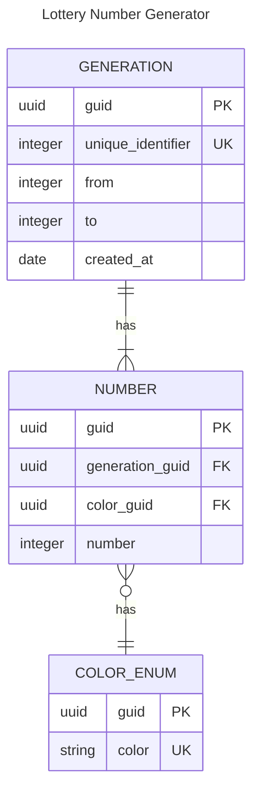

# Entity Relationship Diagram

COLOR_ENUM[^1]
[^1]: The decision for creating color enum as a table is for DBMS compability reasons (specifically SQLite3), in DBMS like PostgreSQL we could just use a ENUM field type
