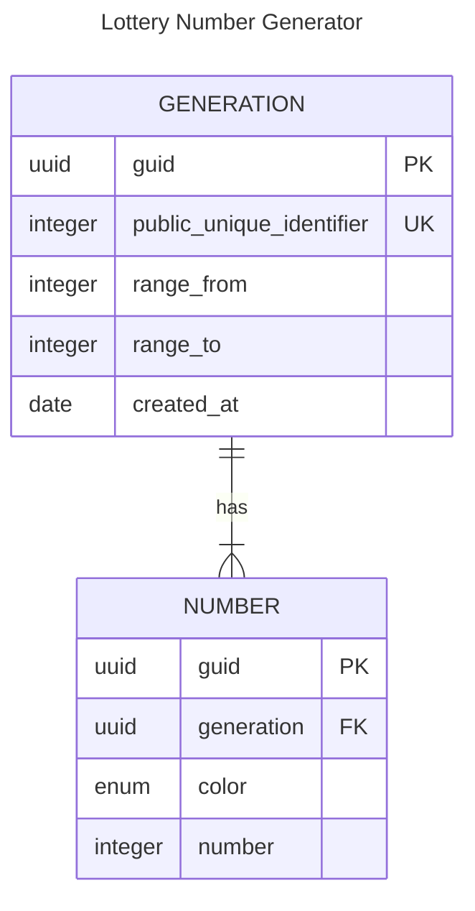

# Entity Relationship Diagram

```mermaid
---
title: Lottery Number Generator
---
erDiagram
    GENERATION {
        uuid guid PK
        integer public_unique_identifier UK
        integer range_from
        integer range_to
        date created_at
    }

    NUMBER {
        uuid guid PK
        uuid generation FK
        enum color
        integer number
    }

    GENERATION ||--|{ NUMBER : has
```
