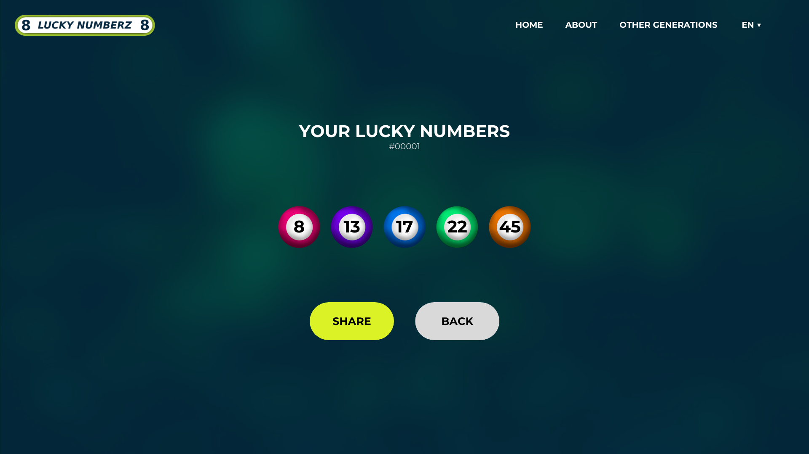

# GUI Prototype

## 1. Introduction

The graphical user interface prototypes are high fidelity prototypes made in Canva ([click here to open](https://www.canva.com/design/DAF4f4HmOGY/6lRSgJ89261rJ4X6f1apfA/edit?utm_content=DAF4f4HmOGY&utm_campaign=designshare&utm_medium=link2&utm_source=sharebutton)) on target resolution of 1920x1080.

## 2. Colors

The original idea behind this web app is a random number generator that generates numbers for a lottery game, with that in mind the main color chosen was green that refers to money, so the chosen palette was [Green Globe On Moss](https://color.adobe.com/Green-Globe-On-Moss---Environmental-Concept--color-theme-12819809/) which uses tones of green.

## 3. Background

The background image is an edited picture of a bunch of clovers that refers to lucky and money. [Original picture from Sudipta  Mondal in Pexels](https://www.pexels.com/pt-br/foto/plantas-verdes-em-solo-preto-1441460/).

## 4. Logo and other images

Images like the fictional logo "8 Lottery Numberz 8" and the colored bingo balls aren't registered trademarks, are original creations and unlicensed.

## 5. Pages

This web application is planned to have 4 main pages which are described in this section and illustrated by the high fidelity prototype images.

## 5.1 Home Page

The home page (and also the landing page) is directly the random number generator with fields and labels pointing what they mean and how should be used.

## 5.2 Generated Numbers Detail Page

The detail page for generated numbers is composed by a label "Your lucky numbers", an unique identifier of that generation, the numbers generated in colored bingo balls and two buttons, one for sharing the link of that generation and another for returning back to home page.

## 5.3 Generated Numbers Listing Page

The listing page for generated numbers is composed by a label "Other generated numbers" and a vertical listing (like lines) of every generation sorted by the most recent to most old, each one has its unique identifier, a button to view that leads to detail page for generated numbers, and a preview of the generated numbers that may not include all generated numbers.

## 5.4 About Page

The about page is an informative page that tells the story about the project, who is the author and makes available two buttons, one for the project repository in github and another for the author profile in linkedin.

